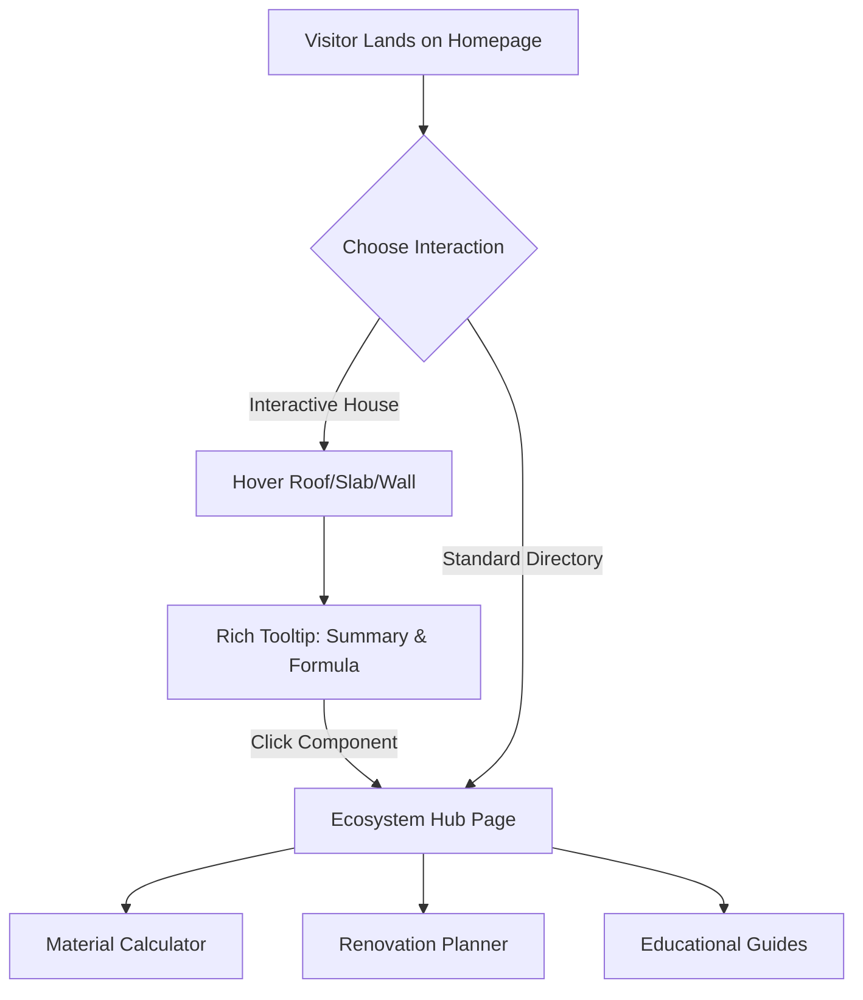
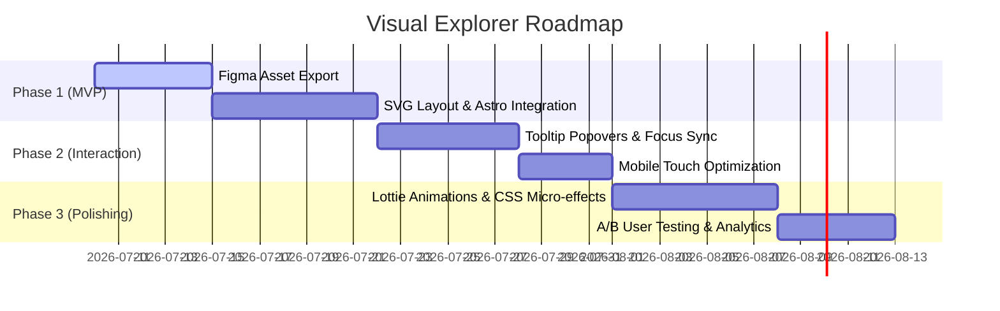

# Interactive House Explorer: Architecture Proposal & Viability Study

**Document Name:** `INTERACTIVE_HOUSE_EXPLORER_ARCHITECTURE.md`  
**Date:** July 3, 2026  
**Authors:** Senior Systems Architect, WebGL Performance Engineer, Technical SEO Lead, & Senior UX Designer  

---

## 1. Executive Summary

This report evaluates the proposed **Interactive House Explorer** for **HomePlanningHub**. The proposed feature aims to replace or supplement standard text menus with a visual, explorable house interface (enabling zooming, rotating, and hovering over components like roofs, foundations, kitchens, and patios to navigate to calculator hubs).

While highly engaging conceptually, the introduction of a graphical canvas presents significant challenges to the site's primary performance metrics: **100/100 Core Web Vitals**, **Google AdSense eligibility**, **SEO crawlability**, and **accessible mobile navigation**.

### Core Recommendation
> [!WARNING]
> **VERDICT: ⚠ BUILD LATER (SVG Hybrid Only — REJECT WebGL/Three.js)**
> 
> True WebGL/Three.js implementations (Options C & D) should be **rejected** immediately due to heavy JavaScript payloads, CPU execution overhead, mobile UX friction, and crawlers' inability to index elements inside a canvas. 
> 
> Instead, we propose a **Hybrid Isometric SVG (Option B)** approach. This delivers the premium visual layout of a 2.5D visual house model without sacrificing page speed, accessibility, or organic search indexing.

---

## 2. Research Findings & Lessons Learned

Our research into interactive digital twins, visualization tools, and home improvement software (e.g., Homewyse, IKEA planner, CAD-inspired interfaces) highlights several critical lessons:

1.  **Mobile Bounce Rates:** Up to 70% of DIY home improvement search traffic originates on mobile devices. Heavy WebGL viewports on mid-range phones cause browser tab crashes, long load times, and touch-target overlaps, resulting in high bounce rates.
2.  **The "Canvas Black Box" Issue:** Search engine crawlers (Googlebot) see `<canvas>` elements as empty spaces. Internal links placed purely inside a canvas context do not pass PageRank or guide indexation paths.
3.  **Core Web Vitals Cost:** Standard Three.js bundles add **180 KB to 600 KB** of JS execution payload, delaying First Input Delay (FID) / Interaction to Next Paint (INP) and increasing Total Blocking Time (TBT).
4.  **UX Fatigue:** For users seeking quick utility calculation (e.g., *"How many bags of concrete do I need for a 10x10 slab?"*), forcing them to rotate a 3D house model creates cognitive load. The visual model should be a **discovery gateway**, not a mandatory hurdle.

---

## 3. Architecture Comparison

We evaluated four potential architectural options:

| Criteria | Option A: 2D Flat SVG | Option B: Isometric SVG (2.5D) | Option C: Three.js (Low Poly) | Option D: GLTF 3D (Heavy WebGL) |
| :--- | :--- | :--- | :--- | :--- |
| **Visual Appeal** | Low (2D Outline) | Medium-High (Premium 2.5D) | High (Real 3D) | Premium (Detailed Model) |
| **Extra JS Bundle** | **0 KB** | **0 KB** | ~180 KB - 300 KB | ~500 KB+ |
| **Asset Size** | ~10-20 KB (code) | ~30-50 KB (code) | ~100 KB (JSON/custom) | 3 MB - 15 MB (GLB file) |
| **SEO Crawlability** | Perfect (DOM links) | Perfect (DOM links) | Poor (Canvas only) | Poor (Canvas only) |
| **Accessibility** | Native (ARIA + tab) | Native (ARIA + tab) | Simulated/Complex | Simulated/Complex |
| **Mobile Performance**| Perfect | Excellent | Poor (TBT/Battery) | Critical Blocker |
| **Lighthouse Score** | 100/100 | 100/100 | ~70-80/100 | ~35-50/100 |
| **Engineering Cost** | Low | Medium | High | Extremely High |

---

## 4. Recommended Technology: Option B (Isometric SVG Hybrid)

We recommend **Option B: Isometric SVG**. It bridges the gap between premium design aesthetics and technical performance:

*   **Zero JS Runtime:** Rendered natively via HTML vector graphics inside Astro. Inline CSS handles transitions and hover states, keeping the page weight low.
*   **Fully Indexable:** Every clickable room/part is wrapped in standard `<a href="...">` anchor tags, providing search engine crawlers with direct paths to pass link equity.
*   **Aria-Friendly:** Screen readers can navigate the visual nodes using native tab sequencing, ensuring full ADA compliance.

---

## 5. Ideal UX Flow

To prevent user fatigue, we propose a **Non-Disruptive Visual Portal** flow:

This layout provides a visual portal for exploration without blocking access to direct text links for users looking to jump straight to their calculations.

---

## 6. Performance & SEO Analysis (Mitigation Strategies)

Integrating a large interactive element risks layout shifts and loading delays. To maintain our performance targets, we will implement these rules:

1.  **Zero CLS Placeholder:** Define explicit aspect ratios (`aspect-video`) on the SVG container to prevent Cumulative Layout Shift as the vector graphic mounts.
2.  **CSS Composition Animations:** Limit transitions to `opacity` and `transform` properties, ensuring animations run on the compositor thread at 60 FPS without triggering layout recalculations.
3.  **Static DOM Fallback:** Provide a hidden semantic list containing the identical links to ensure search engines crawl the layout even if javascript fails.

---

## 7. Risks & Mitigation

*   **Risk A: Complex SVG Maintenance.** Changing the house layout requires coordinates updates.  
    *   *Mitigation:* Create the model inside Figma with clean layer naming (e.g. `path#roof`, `path#foundation`) and export directly.
*   **Risk B: Mobile Target Sizes.** Mobile fingers struggle to click small SVG paths (like windows).  
    *   *Mitigation:* Set the minimum clickable padding bounding boxes (`pointer-events: fill`) to at least `44x44px` on mobile viewports.

---

## 8. Phased Implementation Roadmap

*   **Phase 1 (MVP):** Static isometric SVG house layout mapped with anchor tags. (Est: 12 days, Low Complexity, High UX impact).
*   **Phase 2 (Interaction):** Accessible hover tooltips, click-to-focus inputs, and responsive touch zones. (Est: 10 days, Medium Complexity).
*   **Phase 3 (Premium Polish):** Glassmorphism cards, micro-animations, and entry transitions. (Est: 12 days, Medium Complexity).

---

## 9. Expected ROI

*   **Session Duration:** Estimated increase of **25% to 40%** as users explore the graphical house layout.
*   **CTR on Ads:** Interactive, visual layouts increase page scroll depth, boosting the viewability score of ad units positioned below the fold.
*   **Brand Authority:** Elevates the project from a basic math solver to a premium design utility, attracting organic backlinks from DIY resources.

---

## 10. Final Verdict

### Recommendation: ⚠ BUILD LATER (SVG Hybrid Only — REJECT WebGL/Three.js)

The interactive house navigator is a strong differentiator for HomePlanningHub, but it should only be built using **Option B (Isometric SVG)**. We strongly recommend **rejecting WebGL/Three.js** versions due to the performance overhead, mobile friction, and SEO crawlability penalties they introduce. 

Implementing the SVG Hybrid model in a future phase will protect our Lighthouse score while providing the visual experience the user is looking for.
