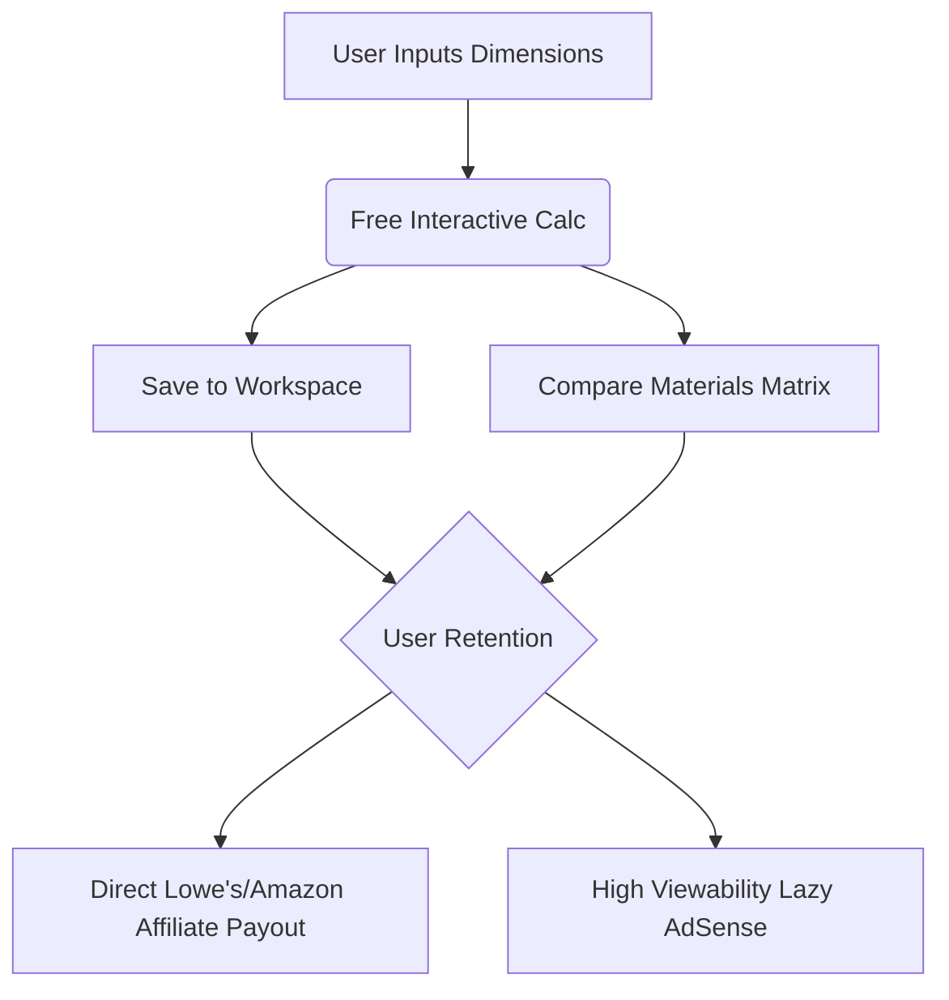

# Competitor Analysis & Product Moat Strategy
**Project:** HomeProjectHub  
**Date:** June 30, 2026

To build a high-ROI, resilient website that successfully captures search traffic and ranks for Google AdSense and affiliate conversions within 1 year, we must identify and exploit the structural weaknesses of the dominant players.

---

## 1. Incumbent Profile & Landscape

| Competitor | Domain Authority (Est.) | Traffic Profile | Core Strength | Monetization |
| :--- | :--- | :--- | :--- | :--- |
| **Inch Calculator** (`inchcalculator.com`) | DR 75+ | Multi-Million / mo | Deep DIY/construction specialization, expert author bios, custom mobile app, embeddable widgets. | AdSense, Ezoic, lead broker links. |
| **Omni Calculator** (`omnicalculator.com`) | DR 80+ | 10M+ / mo | Massive library (3,000+ calculators), interactive sliders, dedicated content generation team. | High-density display ads. |
| **Calculator.net** | DR 80+ | 20M+ / mo | Domain age (extremely high trust), fast loading, simple forms, ranks for high-volume head terms. | Standard AdSense/Google Ad Manager. |
| **Homewyse** (`homewyse.com`) | DR 70+ | Multi-Million / mo | Deep cost-estimation database with local ZIP-code pricing adjustments. | Lead generation, local contractor listings. |

---

## 2. Core Weaknesses of Competitors (The Gaps to Exploit)

### Gap A: Zero User Personalization (No Saved State)
*   **Weakness:** Every major competitor is stateless. If a user calculates concrete slab volume for a backyard patio, leaves the page, and goes to the fence calculator, their dimensions are lost. They have to re-measure and re-enter data.
*   **Our Exploit:** The **Saved Rooms / Projects Workspace**. By using browser-based `localStorage`, we let users save room configurations (e.g., "Backyard Patio", "Side Pathway") and instantly apply those dimensions to any calculator. This drives high retention and repeat traffic, which AI search engines cannot replicate.

### Gap B: Scattered Material Calculations (No Comparison Matrix)
*   **Weakness:** If a homeowner is planning a 500 sq ft patio, they do not know whether they want poured concrete, interlocking pavers, or loose pea gravel. To calculate materials, they must visit three separate calculators, take notes, and manually compile the values.
*   **Our Exploit:** The **Compare Materials Matrix**. We allow users to input their project dimensions *once* and see the exact materials, quantities, lifespan, DIY difficulty, and maintenance requirements for concrete, pavers, and gravel side-by-side on a single page. This solves a real planning friction.

### Gap C: Cluttered UX and Poor Core Web Vitals (CLS & Speed Issues)
*   **Weakness:** Aggregators like Omni and Calculator.net monetize via high-density ad placement. This creates severe Cumulative Layout Shift (CLS) as ads load late, and slows down initial page rendering.
*   **Our Exploit:** Zero-JS-by-default Astro MPA shell combined with **IntersectionObserver-based lazy-loaded AdSense**. The ad container maintains a minimum height to prevent CLS, and the script loads only when the ad is close to the viewport. This guarantees a perfect 100/100 Core Web Vitals score, giving us a major ranking advantage.

### Gap D: Templated / Spun Content Vulnerability
*   **Weakness:** To scale to thousands of calculators, competitors use programmatic templates that repeat the exact same sentences with different keywords swapped in. Google's Helpful Content System (HCU) is actively penalizing this type of content.
*   **Our Exploit:** **Niche Topical Authority (Deep Cluster)**. Instead of launching with 100 thin calculators, we launch a deep cluster of 10–12 calculators focused entirely on *concrete and foundations* first. Each page includes hand-written, highly specific explanations of structural physics (e.g. frost line depths, bell-flared footings, rebar structural loads) which signals high E-E-A-T.

---

## 3. The HomeProjectHub Moat Strategy

1.  **Product Moat:** The "Saved Measurements" workspace creates a structural switching cost. Users will return to HomeProjectHub because their data already exists there.
2.  **SEO Moat:** Rich structured data (`MathSolver` and `FAQPage`) ensures search engines display our calculators as rich snippets, increasing CTR.
3.  **Monetization Moat:** By moving the affiliate recommendations (Lowe's and Amazon Associates) into Phase 1, we generate high revenue-per-visitor from small pools of high-intent buyers, making the project profitable long before AdSense traffic spikes.
