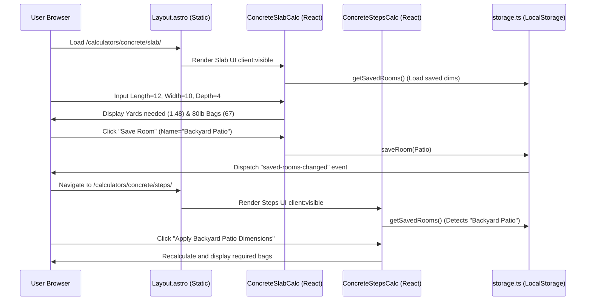

# Production System Architecture: HomePlanningHub
**Role:** Senior Systems Architect  
**Target:** High-Growth SEO & Affiliate Platform

This document establishes the scalable system architecture and component structure for **HomePlanningHub**, designed to support millions of monthly visits at near-zero hosting cost, maintaining 100/100 Core Web Vitals, and maximizing Google AdSense/affiliate revenues.

---

## 1. High-Level System Infrastructure

We utilize an **Edge-First Static Architecture** to minimize Time to First Byte (TTFB) and completely eliminate database query overhead for public traffic.

```mermaid
graph TD
    User[User Browser] -->|HTTPS Requests| CF[Cloudflare Edge CDN]
    CF -->|Edge Cache Hit 99%| PageDelivery[Static HTML/CSS/JS]
    CF -->|Edge Cache Miss| CF_KV[Cloudflare KV / Storage Bucket]
    
    subgraph Client-Side Browser Environment
        PageDelivery -->|Lazy Load| AdSense[Google AdSense Script]
        PageDelivery -->|Lazy Load| GA4[Google Analytics]
        PageDelivery -->|Client Interaction| ReactIslands[React Calculator Islands]
        ReactIslands -->|Sync Dimensions| LocalStorage[LocalStorage Workspace]
        ReactIslands -->|Affiliate Clicks| AffiliateLinks[Lowe's / Amazon Affiliates]
    end
    
    subgraph Static Compilation (CI/CD Build Time)
        AstroBuild[Astro SSG compiler] -->|Generates| Dist[Static /dist folder]
        SitemapIntegration[Astro Sitemap] -->|Generates| Sitemaps[Sitemap Indexes]
        TailwindCompiler[Tailwind v4 compiler] -->|Outputs| CSS[Optimized Tailwind CSS]
    end
    
    Dist -->|Deploy to CF Pages| CF_KV
```

### Infrastructure Components:
*   **CDN & Hosting:** Cloudflare Pages. Routes are served as pre-rendered static HTML files directly from the edge. This protects the site from traffic spikes and keeps server costs at $0.
*   **Asset Pipeline:** Astro.js SSG + Vite compilation. Tailwind CSS v4 compiles utility classes into a single static CSS bundle without runtime parsing.
*   **Third-Party Integrations:** AdSense and Google Analytics are sandboxed and lazy-loaded on the client side using the `IntersectionObserver` API to protect the main thread and maintain high performance scores.

---

## 2. Codebase Component Structure

The directory is structured using a **Feature-Based Monolithic Separation** pattern. All business logic is decoupled from UI presentation to allow easy migration to a B2B white-labeled API or package format in the future.

```text
src/
├── assets/                  # Static media, icons, and logo assets
├── components/
│   ├── ui/                  # Reusable, accessible atomic components (Button, Input, Card)
│   ├── calculators/         # Interactive React calculator islands (Slab, Footing, Steps)
│   ├── AdSlot.astro         # Lazy-loaded AdSense container with CLS prevention
│   └── CompareMaterials.tsx # Multi-material comparisons matrix
├── layouts/
│   └── Layout.astro         # Core HTML shell (handles SEO, meta tags, schema injects, and GA)
├── lib/
│   ├── geometry.ts          # Pure arithmetic, shape areas, and dimension conversions
│   ├── materialEngine.ts    # Material packaging yields, waste factors, and weight limits
│   └── storage.ts           # LocalStorage workspace data state manager
├── pages/
│   ├── compare/             # Detailed comparison landers (concrete-vs-pavers, etc.)
│   ├── calculators/         # Nested material categories (concrete, roofing, etc.)
│   ├── saved.astro          # User measurements workspace dashboard
│   ├── index.astro          # Landing page (deep cluster categories)
│   └── [legal].astro        # AdSense gate pages (privacy, terms, about, contact, disclaimer)
public/
├── robots.txt               # Crawler directives
└── sitemap-index.xml        # Compiled sitemap indexes (generated during build)
```

---

## 3. Component & State Lifecycle

To keep the platform performant, we use **React Islands** inside a **Static Astro Shell**. The components communicate asynchronously using browser events and read/write to LocalStorage to share workspace coordinates.



---

## 4. Production-Ready Optimization Standards

### A. AdSense CLS Optimization (Cumulative Layout Shift = 0)
AdSense units loading asynchronously frequently push content down, destroying user experience and search rankings. Our architecture forces ad slots to act as pre-reserved boxes:
1.  The `AdSlot.astro` component wraps the `<ins class="adsbygoogle">` tag inside a fixed-height placeholder (`min-h-[250px]`).
2.  An `IntersectionObserver` monitors scroll distance and only appends the external `adsbygoogle.js` script tag when the user is 200px away from viewing the ad.

### B. Mathematical Decoupling (EEAT Validation)
By segregating calculations into `lib/geometry.ts` and `lib/materialEngine.ts`, we can guarantee that:
*   Formulas can be easily verified using unit tests.
*   The same mathematical models are shared across the comparison matrix (`CompareMaterials.tsx`) and the individual calculators, preventing discrepancies.
*   Calculators can instantly support different measurement standards (Imperial vs Metric) at the core engine level.

### C. Search Engine Optimization (SEO) Integration
*   **Metadata:** Title, description, and canonical tags are fed into `Layout.astro` on every page render.
*   **Sitemap:** Generated dynamically during compilation to guarantee that search engine indices are updated automatically whenever a new page is added.
*   **Structured Schemas:** `MathSolver` and `FAQPage` LD-JSON scripts are injected directly into the HTML to maximize rich snippet click-through rates.
