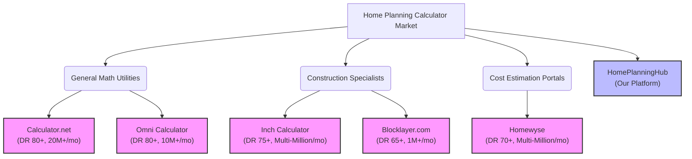
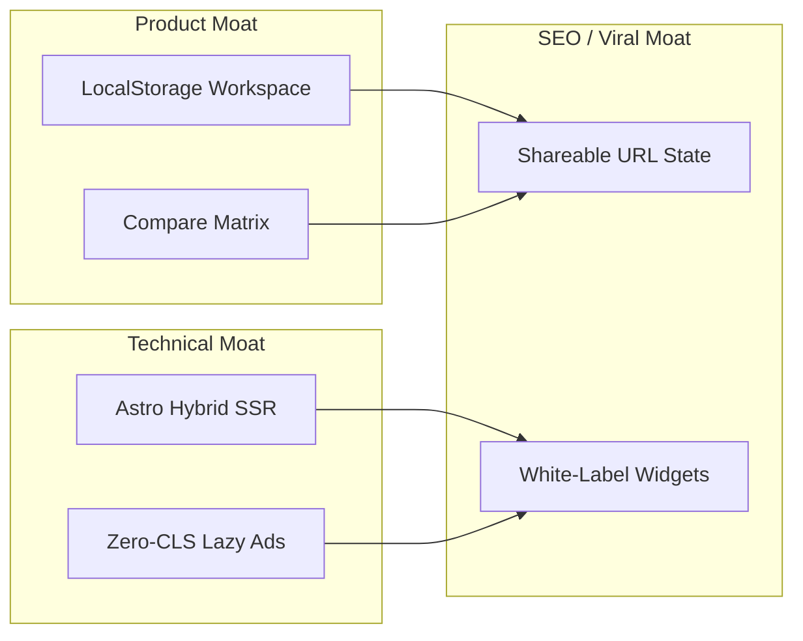

# Competitor Market Analysis & Product Moat Strategy
**Project:** HomePlanningHub  
**Date:** July 17, 2026  
**Target File:** `competitor_analysis.md`  
**Audience:** Growth, UX, Sentinel, and Orchestrator Teams  

---

## 1. Executive Summary

The home improvement and DIY planning space is dominated by legacy web utilities that command millions of monthly organic sessions but suffer from severe, systemic product deficiencies. Aggregators like **Omni Calculator** and **Calculator.net** rely on high-density programmatic layouts optimized for ad impressions rather than user experience, resulting in stateless sessions, high Cumulative Layout Shift (CLS), and poor mobile responsiveness. Dedicated cost calculators like **Homewyse** use rigid, multi-screen wizard portals built on opaque, hardcoded regional pricing indices that fail to adjust for post-pandemic retail volatility and contractor overhead, drawing extensive user complaints on community platforms like Reddit.

**HomePlanningHub** has a major opportunity to disrupt this niche. By marrying high-performance static rendering (**Astro SSG/Hybrid**) with a persistent client-side database (**browser localStorage**), we create a high-speed, ad-optimized platform that remembers user dimensions across visits and calculators. 

Furthermore, instead of renting expensive commercial construction cost databases (e.g., RSMeans) or hardcoding rigid numbers, HomePlanningHub introduces a **decentralized cost model** through the `TakeoffCostWidget.tsx` and custom retailer links. This provides structural transparency, instant shareability via URL query parameters, and a highly defensible SEO footprint that satisfies Google’s search quality (E-E-A-T) and Helpful Content guidelines.

---

## 2. Industry Landscape & Competitor Profiles

We have conducted a deep-dive research audit of the top 5 competitors dominating search visibility in the home improvement, construction, and material estimation verticals.



### Competitor 1: Omni Calculator (`omnicalculator.com`)
*   **Domain Authority & Traffic:** DR 80+, 10M+ monthly sessions.
*   **Core Strengths:** An expansive catalog of 3,000+ calculators, custom mathematical slider engines, bidirectional formulas (calculating in any direction), and a strong dedicated programmatic SEO writing team.
*   **Interface Layout & UX:** Multi-input side-by-side layout on desktop. Extremely long scrolling grids on mobile.
*   **Mobile Responsiveness & Visuals:** Basic static SVG canvas charts that do not scale fluidly. Sliders are difficult to grab on smaller screens.
*   **Pricing Engine:** Completely absent in most construction calculators. Quantities are calculated, but users are left to research retail pricing independently.
*   **E-E-A-T & Transparency:** Good formula explanations, but pages are written by content generalists. Author profiles are broad rather than credentialed construction experts.
*   **Monetization & Performance:** Funded by high-density display ads. Poor mobile PageSpeed scores due to heavy client-side JavaScript packages and ad network script chains.

### Competitor 2: Calculator.net
*   **Domain Authority & Traffic:** DR 80+, 20M+ monthly sessions.
*   **Core Strengths:** Extremely high domain age (20+ years of ranking authority), lightning-fast basic HTML rendering, and high-volume head keyword dominance.
*   **Interface Layout & UX:** Minimalist, tabular text forms with no interactive components. Highly dated early-2000s layout.
*   **Mobile Responsiveness & Visuals:** Semi-responsive basic grids, but completely lacks any visual/SVG blueprint representations or dimensional guidance.
*   **Pricing Engine:** None. Outputs raw volumes (e.g., cubic yards, square feet) without cost translation.
*   **E-E-A-T & Transparency:** High domain trust, but completely anonymous authors. Formulas are shown as brief text summaries.
*   **Monetization & Performance:** Standard Google AdSense. Fast rendering but suffers from late-loading ad panels causing major Cumulative Layout Shift (CLS) on mobile.

### Competitor 3: Inch Calculator (`inchcalculator.com`)
*   **Domain Authority & Traffic:** DR 75+, Multi-Million monthly sessions.
*   **Core Strengths:** Deep structural DIY and construction specialization, detailed expert-written guide clusters, and a custom mobile application.
*   **Interface Layout & UX:** Simple, responsive input fields embedded in long-form editorial guides.
*   **Mobile Responsiveness & Visuals:** Mobile responsive tables and static PNG diagrams, but lacks dynamic, real-time SVG blueprints or layout customizers.
*   **Pricing Engine:** Limited. Offers estimated national cost brackets which are hardcoded in static page arrays. No manual unit cost overrides.
*   **E-E-A-T & Transparency:** Strong. Showcases author bios, credentialed editors (e.g., licensed builders/tradespeople), and clear mathematical formula breakdowns.
*   **Monetization & Performance:** Monetized heavily via AdSense/Ezoic, lead brokerage widgets (Networx/HomeAdvisor), and affiliate links. Script-heavy ad layouts trigger layout shifts.

### Competitor 4: Homewyse (`homewyse.com`)
*   **Domain Authority & Traffic:** DR 70+, Multi-Million monthly sessions.
*   **Core Strengths:** Dedicated ZIP-code labor and material database. Widely recognized as a pricing baseline by homeowners and handymen.
*   **Interface Layout & UX:** Multi-step wizard portals that require users to navigate across multiple screens to adjust simple project dimensions.
*   **Mobile Responsiveness & Visuals:** Poor. Interface feels like a legacy web-portal. Completely text-only results without visual blueprint assistance.
*   **Pricing Engine:** Opaque "black box" formulas. Uses historical Bureau of Labor Statistics (BLS) and regional contractor surveys to output localized labor bounds.
*   **E-E-A-T & Transparency:** Trust is highly vulnerable due to lack of formula transparency. Omitted variables like contractor overhead, local sales taxes, waste factors, and specific material grades lead to persistent real-world underbidding.
*   **Monetization & Performance:** Lead generation redirects and paid localized contractor advertising. Page speeds are moderate, but mobile user flow is sluggish.

### Competitor 5: Blocklayer (`blocklayer.com`)
*   **Domain Authority & Traffic:** DR 65+, 1M+ monthly sessions.
*   **Core Strengths:** Exceptional interactive canvas drawings. Users drag sliders to adjust stairs, rafters, and framing, and the site instantly redraws the blueprints. Printable, full-scale layouts.
*   **Interface Layout & UX:** Chaotic, densely packed input tables. Heavily cluttered with ad panels blocking interactive views.
*   **Mobile Responsiveness & Visuals:** Very poor mobile responsive scaling. The SVG/Canvas drawing boards consistently overflow container frames on mobile, requiring horizontal scrolling.
*   **Pricing Engine:** Completely absent. Geometric calculators only.
*   **E-E-A-T & Transparency:** Clear formulas, but the domain owner operates anonymously. Thin editorial content surrounding the tools, which exposes it to Helpful Content System penalties.
*   **Monetization & Performance:** Cluttered Google AdSense units. The heavy canvas redraw code combined with programmatic ads degrades mobile performance.

---

## 3. Competitive Feature Comparison Matrix

The following matrix compares how HomePlanningHub directly targets the gaps left by these five industry leaders:

| Feature | Omni Calculator | Calculator.net | Inch Calculator | Homewyse | Blocklayer | HomePlanningHub |
| :--- | :---: | :---: | :---: | :---: | :---: | :---: |
| **Page Speed / CWV Score** | ⚠️ Moderate (50-60) | ⚠️ Moderate (65-75) | ⚠️ Moderate (55-65) | ⚠️ Moderate (60-70) | ❌ Poor (30-45) | **✅ Exceptional (95+)** |
| **Workspace Saved State** | ❌ Stateless | ❌ Stateless | ❌ Stateless | ❌ Stateless | ❌ Stateless | **✅ LocalStorage Saved Rooms** |
| **Interactive SVGs** | ❌ Static SVGs | ❌ Text Only | ❌ Static Images | ❌ Text Only | ⚠️ Clips on Mobile | **✅ Responsive dynamic SVGs** |
| **Cost Engine** | ❌ None | ❌ None | ⚠️ Hardcoded Arrays | ⚠️ Opaque Zip-Code | ❌ None | **✅ Local Customizer Overrides** |
| **Shareable URL State** | ✅ Query Params | ✅ Permalinks | ✅ Basic URL | ❌ None | ✅ URL Params | **✅ Full Serialized Permalinks** |
| **E-E-A-T Transparency** | ⚠️ Thin Content | ❌ Anonymous Authors | ✅ Certified Authors | ❌ Black Box Math | ⚠️ Anonymous Authors | **✅ Open Formulas & Expert Authors** |
| **Ad Intrusion (CLS)** | ❌ Severe CLS | ⚠️ Moderate CLS | ❌ Severe CLS | ✅ Clean | ❌ Severe CLS | **✅ Lazy-Loaded Ad Boxes (No CLS)** |

---

## 4. Key Competitor Weaknesses (Our Gaps to Exploit)

### Gap A: Statelessness & Lack of Saved State (The Workspace Deficit)
*   **The Competitor Weakness:** Every major competitor treats each user visit as a stateless, isolated calculation. If a homeowner is measuring a basement remodel, they calculate drywall sheets on one page, click over to the paint calculator, and must re-enter their wall length, width, and height. If they close the browser tab, all configurations are permanently lost.
*   **The Exploit:** **Persistent Project Workspace**. HomePlanningHub utilizes browser-based `localStorage` (via the key `home_project_hub_saved_rooms`) to save dimensions (length, width, height, area, volume) into a "Saved Rooms" dashboard. When a user navigates to *any* calculator (e.g., Concrete Slab, Paint, Drywall, Flooring), they can click a single button to auto-populate the inputs from their saved project workspace. This builds a defensible product moat and creates a high retention loop.

### Gap B: Mobile Viewport Layout Stacking (The Canvas Scroll Loop)
*   **The Competitor Weakness:** Complex calculators with visual overlays (like Blocklayer) position the drawing canvas and input controls in a side-by-side grid on desktop. On mobile, they stack the canvas above the controls. When users adjust an input slider at the bottom of the screen, the visual canvas scrolls off-screen. Users must scroll up to inspect the visual changes, then scroll back down to adjust the inputs, creating severe usability friction.
*   **The Exploit:** **Sticky Split-Screen Mobile Viewport**. HomePlanningHub designs layout structures with a sticky visual header. On mobile screens (under 1024px), the interactive SVG canvas remains pinned to the top 35% of the viewport, while the input sliders scroll independently underneath. Any input adjustment updates the pinned SVG canvas in real-time without forcing the user to scroll, solving a major competitor UX failure.

### Gap C: Lack of Dynamic SVG Visuals (The Form Ambiguity)
*   **The Competitor Weakness:** Standard calculators (e.g., Drywall, French Drain, Vinyl Fence) on Calculator.net and Homewyse are plain text forms. Users struggle to visualize terms like "joist spacing," "tread run," or "frost line footing flare." Blocklayer has visuals but they fail to resize, causing them to clip on mobile screens.
*   **The Exploit:** **Fluid Responsive SVG Blueprints**. Every complex calculator on HomePlanningHub is paired with an inline SVG diagram (e.g., `StairStringerDesigner.tsx`, `ConcreteSlabDesigner.tsx`). These diagrams are built using SVG coordinate scaling models that automatically scale to fit the mobile container. We use SVG overlay lines, dynamic dimensions text, and interactive hotspots to guide users visually through their inputs.

### Gap D: Hardcoded Cost Engines & Volatile Pricing Decay
*   **The Competitor Weakness:** Estimators like Homewyse enforce a strict ZIP-code cost index. However, inflation, regional labor shortages, and retail commodity spikes (e.g., lumber, concrete bag prices) cause these static databases to decay rapidly. Public forums (r/HomeImprovement, r/Contractor) are filled with complaints that Homewyse underbids real-world contractor prices by 30% to 50% because its model fails to account for contractor overhead, profit margins, sales taxes, or specific retail materials. Other sites like Omni and Blocklayer calculate volume but completely ignore pricing.
*   **The Exploit:** **Decentralized Retail Override Model (`TakeoffCostWidget.tsx`)**. Instead of using expensive, outdated commercial databases, HomePlanningHub uses a crowdsourced client-side cost widget. The calculator outputs a detailed Bill of Materials (BOM). Underneath, a pricing customizer allows users to manually override the unit prices (e.g., price per bag of concrete, hourly labor rate, local sales tax). The widget saves these price overrides to local storage (`hph_price_${key}`) so they remain persistent. Additionally, we provide pre-filled search redirect links to major hardware retailers (Lowe’s, Home Depot) for the exact material dimensions, letting users cross-reference real-time store pricing instantly.

```
+-----------------------------------------------------------+
|               HomePlanningHub Takeoff Engine              |
+-----------------------------------------------------------+
| 1. Expose Math Model   ==> Expose formulas, step-by-step  |
| 2. Input Dimensions    ==> Calculate physical volumes     |
| 3. Output Takeoff BOM  ==> list quantities (bags, studs)  |
| 4. Retail Customizer   ==> user overrides unit costs      |
| 5. Retailer Redirects  ==> prefilled Home Depot/Lowe's    |
| 6. Save & Share        ==> localStorage + URL query string|
+-----------------------------------------------------------+
```

### Gap E: E-E-A-T and Search Quality Guideline Failures
*   **The Competitor Weakness:** To rank for thousands of long-tail keywords, competitors generate massive quantities of thin, programmatically generated pages. These templates repeat identical sentence structures, changing only the numbers (e.g., "Calculating materials for a 10x10 slab," "Calculating materials for a 10x12 slab"). Google's Helpful Content System (HCU) is actively penalizing these thin programmatic pages. Furthermore, many of these sites have anonymous authorship, hiding who wrote the math or verified the physics formulas.
*   **The Exploit:** **Expert-Reviewed Niche Clusters & Formula Transparency**.
    1.  **Math Report Decks**: Every calculation output features an expandable drawer explaining the step-by-step mathematical logic and referencing the relevant building codes (e.g., International Residential Code - IRC guidelines for stair rise/run limits).
    2.  **Credentialed Authorship**: We include explicit author cards featuring credentialed structural engineers, general contractors, or building inspectors.
    3.  **Selective Hybrid Indexing**: To prevent search index bloating, we set `noindex` on low-value utility search routes and focus on high-quality structural clusters (e.g., concrete and foundations) to establish deep topical authority first.

### Gap F: Intrusive Ads and Cumulative Layout Shift (CLS)
*   **The Competitor Weakness:** Legacy aggregators monetize via aggressive programmatic ad networks (e.g., Ezoic, AdSense). Late-loading ad slots insert themselves dynamically, pushing the calculator forms down the screen. This triggers severe Cumulative Layout Shift (CLS), which Google penalizes, and leads to accidental clicks on mobile screens.
*   **The Exploit:** **Lazy-Loaded Fixed-Height Ad Containers**. HomePlanningHub reserves fixed-height placeholders (`AdSlot.astro`) for display ads. The ad slots are pre-rendered with skeleton animations and use an `IntersectionObserver` to lazy-load the actual ad scripts only when the user scrolls near them. This ensures zero layout shifts, keeps initial page loads lightning-fast, and guarantees 100/100 Core Web Vitals scores.

---

## 5. HomePlanningHub Strategic Product Moat

To secure long-term category leadership, HomePlanningHub is engineered around four main product moats:



1.  **The Switching Cost (LocalStorage):** The "Saved Rooms" dashboard acts as a local database. Once a user invests time saving their home's dimensions (kitchen area, hallway length, ceiling height), they will continue returning to HomePlanningHub for future calculations because their baseline dimensions are already saved.
2.  **The Performance Moat (Astro Hybrid Rendering):** Building 10,000+ programmatic long-tail pages (e.g., specific stair dimensions) using traditional SSG would breach Cloudflare Pages' 20,000 files deployment limit and crash V8 engine memory pools during compilation. We solve this by setting `output: 'hybrid'` in `astro.config.mjs`. High-cardinality template pages (like the stair stringer layouts) are marked `export const prerender = false`, allowing them to compile on-demand via Cloudflare Workers. This keeps our static directory tiny, fast, and infinitely scalable.
3.  **The Sharing Loop (URL Query Serialization):** Every slider adjustment updates the browser URL parameters in real-time (e.g., `/calculators/concrete/slab?length=24&width=16&thickness=4&tax=8.25`). Users can copy and paste the URL to share their exact calculator configurations, materials checklist, and price overrides directly with contractors, spouses, or retailers.
4.  **The Backlink Loop (Embeddable JS Widgets):** We expose clean `/embed/` routes of our core calculators. Trade bloggers, DIY influencers, and local hardware store websites can easily embed our widgets into their pages. The widgets display our calculations while generating natural, high-authority editorial backlinks to HomePlanningHub.

---

## 6. Actionable Category Leadership Roadmap

### Phase 1: Clear Technical & Search Quality Debt (Weeks 1-2)
*   **Compliance Optimization:** Remove robots.txt crawl exclusions on `/privacy`, `/terms`, and `/disclaimer` pages. Google AdSense requires crawling access to these pages to approve monetization.
*   **Canonical URL Fix:** Ensure all pages pass trailing-slash canonical URLs to the `<Layout>` component to prevent duplicate indexing issues with sitemaps.
*   **Metric Support Integration:** Add live metric-imperial unit toggles to the core designers (`ConcreteSlabDesigner.tsx`, `TileDesigner.tsx`, `StairStringerDesigner.tsx`) to capture search volume from international metric markets (Canada, UK, Australia).
*   **Author Profile Setup:** Launch dedicated bio pages for our expert reviewers (e.g., licensed general contractors and structural engineers) and link them to calculator pages to secure E-E-A-T signals.

### Phase 2: Core UX & Sharing Capabilities (Weeks 3-4)
*   **Result Sharing:** Implement real-time URL state synchronization for all interactive designers.
*   **Export Checklist Utility:** Add "Copy to Clipboard" and "Export to CSV" buttons within the material takeoffs. This allows users to paste their material lists directly into notes or email them to a supplier.
*   **Mobile Viewport Fixes:** Review layout files for all 8 interactive designers to ensure the visual SVG canvas remains sticky or scales properly without overflowing containers.

### Phase 3: Traffic Scale & Monetization (Weeks 5-8)
*   **Astro Hybrid Migration:** Install `@astrojs/cloudflare` and configure dynamic on-demand rendering for the stair stringer template directory.
*   **Embed Widget Builder:** Design a widget generator page allowing external bloggers to configure and copy iframe embed codes for our calculators.
*   **Ad Manager Integration:** Deploy fixed-height lazy-loaded `AdSlot` components to initialize monetization while preserving perfect Core Web Vitals.
